### Sobre o projeto:

O projeto foi feito com o intuito de ajudar academias a gerenciar seus alunos. O projeto conta com um sistema de login e cadastro de administradores, além de um sistema de cadastro de alunos.


Desenvolvido por:
- [Luís Gustavo Alves Bezerra](https://github.com/lu1pinho/)
- [Mara Emanuella](https://github.com/maraemanuella)

Email para contato:
- oluisgustavoalves@gmail.com

Utilizamos as seguintes ferramentas para desenvolver o sistema:
- Java - java version "22.0.1" 2024-04-16
- MySQL - v8.0.37
- NetBeans
- MySQL Workbench
- IntelliJ IDEA

Projeto finalizado em: 02/07/2024


### Como configurar o ambiente de desenvolvimento:

1. Você precisa ter o mysql instalado na sua máquina, caso não tenha, você pode baixar o mysql no site oficial: https://dev.mysql.com/downloads/installer/

Recomendo que você baixe a versão mais recente do mysql, para evitar problemas de compatibilidade. Além de assistir um vídeo de como instalar o mysql, caso você tenha dificuldades.
https://youtu.be/gffMzD8IsRk?si=-b95YLsMTFX2TXeI


#### Essa etapa é bem importante para que o projeto funcione corretamente.
2. Após instalar o mysql, você precisa criar um banco de dados chamado bd_usuario, lembre-se que caso você opte por mudar o nome, terá de alterar o nome da conexão no arquivo `ConnectionFactory.java`

```
public class ConnectionFactory {
    public Connection getConnection() {
        try {
            return DriverManager.getConnection("jdbc:mysql://localhost/bd_usuario", "root", "2027");
        } catch (SQLException excecao) {
            throw new RuntimeException(excecao);
        }
    }
}
```

Além disso, caso você tenha mudado a senha padrão, assim como eu, você terá de alterar a senha no mesmo arquivo.


Para criar o banco de dados você pode fazer a importação usando o arquivo `backup-bd_usuario.sql` que está na raiz do projeto. (AQUI NO GITHUB)
Separei um vídeo para te ajudar a importar o banco de dados, caso tenha dificuldades:
<br>
[Como importar um banco de dados?](https://youtu.be/RkLB0aQh5Es?si=IReV2yNXbCEExd4r&t=355)

Seguindo os passos do vídeo, você conseguirá importar o banco de dados sem problemas. (Assim espero)

3. Após importar o banco de dados, você pode abrir o projeto no seu editor de código favorito e rodar o projeto.

Caso queira acompanhar a adição dos dados no banco, você pode conectar ao banco de dados usando o Workbench, ou usar as funções de database do IntelliJ IDEA.

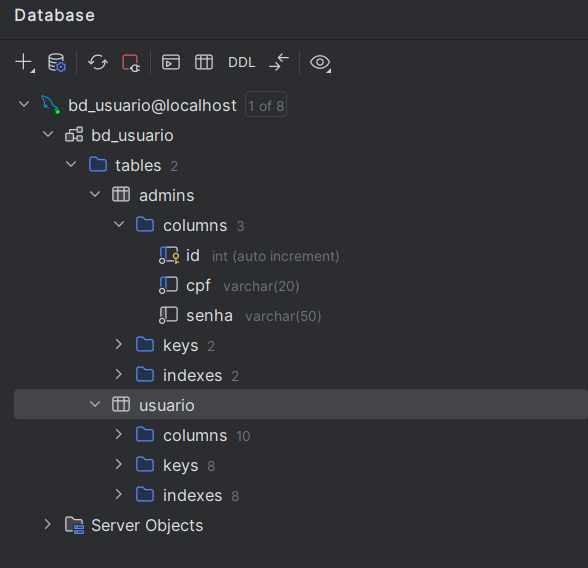

Para adicionar um banco de dados no IntelliJ IDEA, você pode seguir o seguinte tutorial:

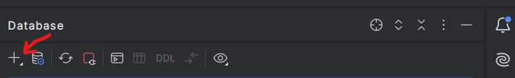

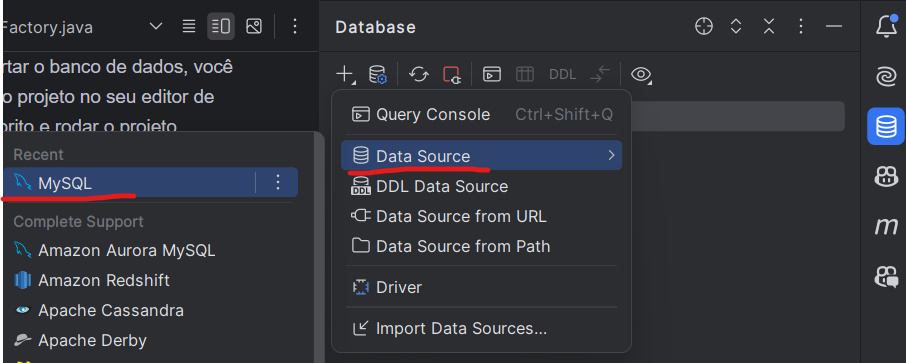

Aqui você deve colocar o nome do banco de dados, o usuário e a senha que você definiu ao instalar o mysql.

Por fim, clique em `Test Connection` para verificar se a conexão foi feita com sucesso.

Caso a conexão tenha sido feita com sucesso, clique em `Apply` e depois em `OK`.

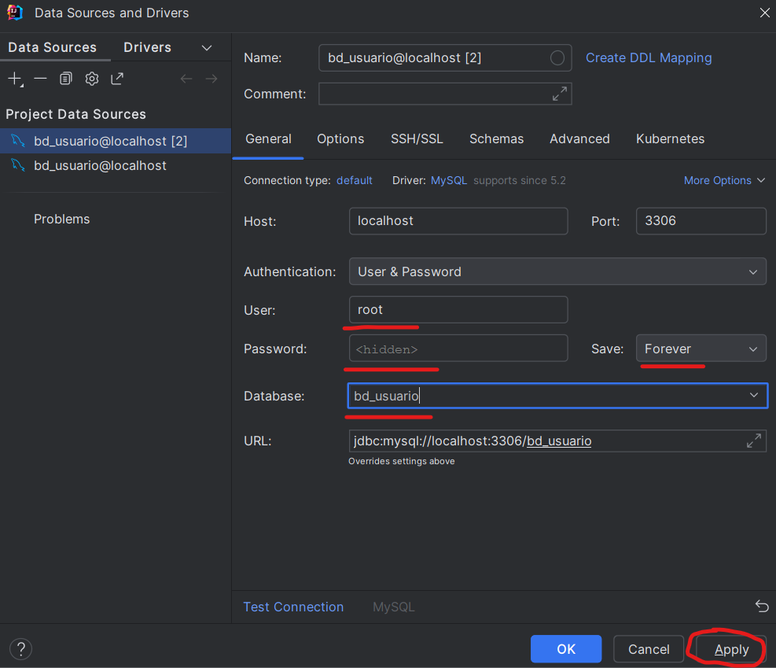

### A primeira parte já foi, agora vamos para a segunda parte do projeto.

Uma coisa importante a mencionar é que o projeto foi feito usando o NetBeans, então, recomendo que você use o NetBeans para rodar o projeto.


Para rodar o projeto, basta clicar com o botão direito no projeto e clicar em `Run File`.

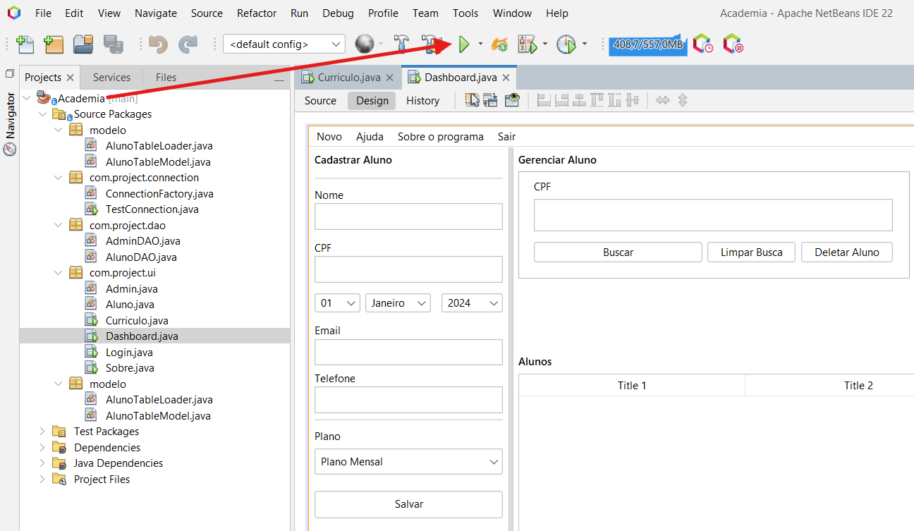

Caso você tenha seguido todos os passos corretamente, você verá a tela de login do projeto. Se ela nem aparecer, é porque algo deu errado, então, volte e verifique se você seguiu todos os passos corretamente.

Lembre-se que no projeto estamos usando o mysql-connector-java-j-8.2.0, então, caso você tenha problemas com a conexão, tente baixar essa versão do conector e adicionar ao projeto. Em tese, você não deveria ter problemas com a conexão, mas, caso tenha, essa é uma possível solução.


### Agora que você já rodou o projeto, vamos para a parte de testes.

Agora que tudo está nos conformes é só testar o projeto.

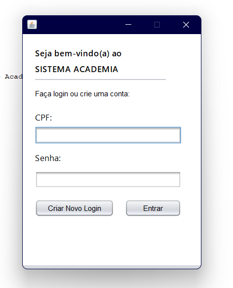

Essa é a nossa humilde tela de Login e cadastro de novos administradores. Ela conta com um sistema de validação de campos, então, caso você tente cadastrar um administrador sem preencher todos os campos, por exemplo, você verá uma mensagem de erro.

Todos esses dados estão sendo salvos no banco de dados que você importou anteriormente.

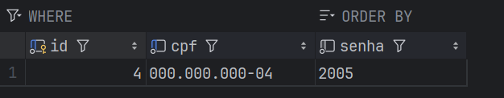

Nossa próxima tela é a Dashboard, nela você pode ver todos os alunos da academia cadastrados no banco de dados, além de poder adicionar novos alunos.

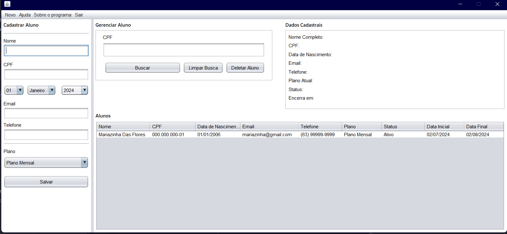


### Importante mencionar:
Todos os campos onde o usuário deve digitar algo, possuem um sistema de validação de campos, então, caso você tente cadastrar um aluno sem preencher todos os campos, por exemplo, você verá uma mensagem de erro. Outro detalhe importante é respeitar a quantidade de caracteres que cada campo aceita, **por exemplo, o campo de telefone aceita obrigatoriamente 12 caracteres, então, caso você tente cadastrar um telefone com mais de 12 caracteres, o sistema não permitirá.**

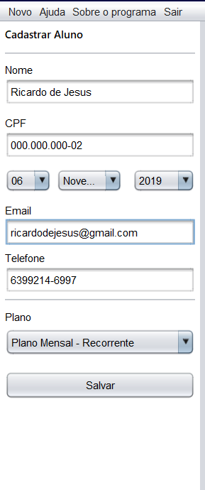

As outras areas do projeto são autoexplicativas, então, não vejo necessidade de explicar cada uma delas.

### Importante:
Colocamos uma barra de navegação no topo do projeto. Tem uma parte destinada a ajudar o usuário a navegar pelo projeto, então, caso você tenha dúvidas, basta clicar em `Ajuda` e você será redirecionado para a página de ajuda.

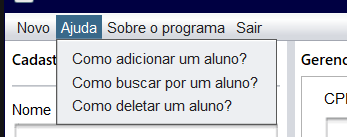

Nessa mesma barra de navegação, temos a parte de Sobre o Programa, onde você pode ver informações sobre o projeto, como a versão, e as informações dos autores. 

Outra coisa interessante sobre a tabela:
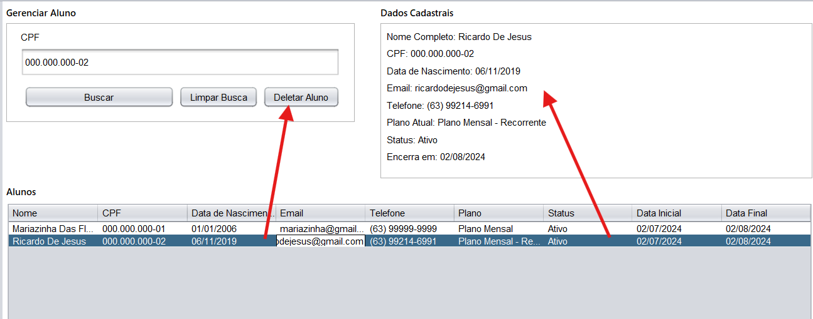

Ao clicar sobre uma linha você verá todas as informações do aluno e poderá remover o aluno do banco de dados apertando diretamente no botão. 

### Fique a vontade para conhecer o projeto e fazer as alterações que achar necessárias.

### Obrigado por ter lido até aqui, espero que o projeto seja útil para você.